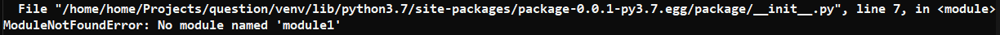
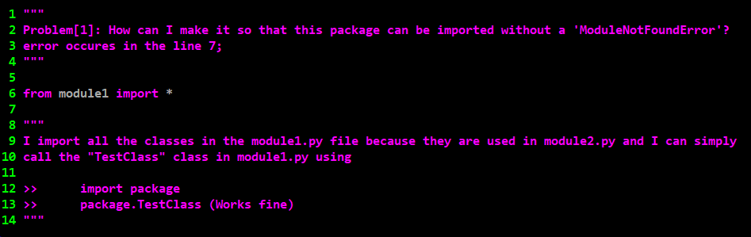
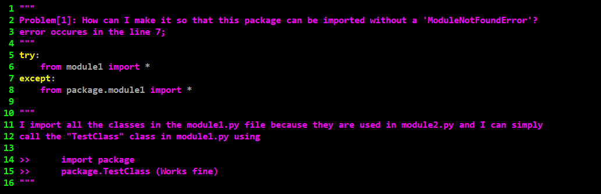
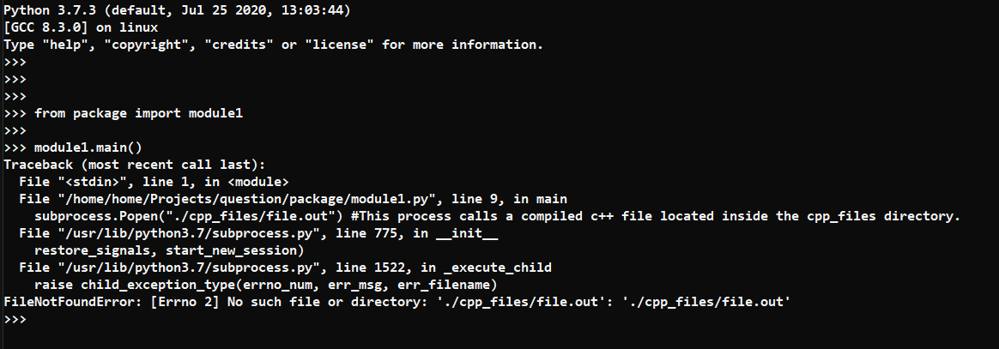

# Overview
                        |
                        |_ package
                        |   |_ cpp_files
                        |   |   |_ file.out
                        |   |_ module1.py
                        |   |_ module2.py
                        |_ setup.py

The package contains python files module1.py and module2.py and a directory called "cpp_files" which has additional files module1.py depends on.  

module1.py -> calls a compiled and executable file written in C++, sing subprocess; which only prints "Hello World".
module2.py -> calls a class defined inside the module1.py file; which only prints a simple message.

# Problem 1:
Inside the __init__.py file. I've imported a class called "TestClass" so that whenever I find the need to use it, I can simply use:
                                                        >>> import package
                                                        >>> package.TestClass
                                                        
However, after the package is installed I get the following ModuleNotFoundError in the __init__.py file.

This error occurs when the file __init__.py is 

This is after the package has been installed by the setup.py file. If i simply run the "python3 __ init __.py" command no error occurs.

To counter this I've used exception handling to handle the ModuleNotFoundError simply as;

This does the trick because now the package has been installed in the environment and despite the import throwing the error it is simply handled. This does not seem quite professional in my eyes. I have the exact same problem in the module2.py file as well where I have the same try...except block. I want to understand what the way to handle this professionally is.

# Problem 2:
As previously mentioned; module1.py runs a external program. This external program is inside the cpp_files directory which is inside the main package directory. When the this method is called like this for example
                                                         >>> from package import module2
                                                         >>> module2.main()

It returns the following error 

even when the package_data has been defined in the setup.py file. But the problem doesn't occur when it is simply compiled using the "python3 module1.py" command.Where is the path to the external data included in the package_data arguement in the setup method? 

# Final Questions:
1) How do I solve problem 1 professionally?
2) Where is the path to the external data included in the package_data arguement?

            
